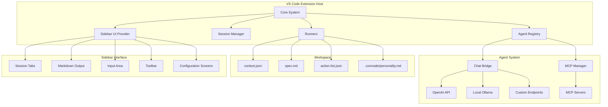

# Design Document

## Overview

Comrade is a VS Code extension that implements a flexible coding agent system with configurable LLM backends. The MVP focuses on "speed mode" - a reactive iterative loop between planning and execution phases, while maintaining an architecture that can be extended to support the full "structure mode" with five distinct areas of concern (context, planning, review, execution, recovery).

The system uses a modular architecture with pluggable agents, a unified chat bridge for LLM communication, and workspace-based configuration files. The design prioritizes VS Code web compatibility and minimal external dependencies.

## Architecture

### High-Level Architecture



### Core Components

1. **Extension Host**: Main VS Code extension entry point
2. **Command System**: VS Code command palette integration
3. **Agent Registry**: Manages available LLM agents and their configurations
4. **Chat Bridge**: Unified interface for communicating with different LLM providers
5. **MCP Manager**: Handles Model Context Protocol server connections and tool invocations
6. **Session Manager**: Handles operation state, cancellation, and progress tracking
7. **Runners**: Specialized classes for context, planning, and execution operations
8. **Sidebar UI Provider**: Manages the dedicated sidebar interface with session tabs and configuration screens
9. **Configuration System**: Workspace and user-level settings management

## Components and Interfaces

### Agent System

#### IAgent Interface
```typescript
interface IAgent {
  id: string;
  name: string;
  type: AgentType;
  provider: LLMProvider;
  config: AgentConfig;
  isAvailable(): Promise<boolean>;
}

enum AgentType {
  PLANNING = 'planning',
  EXECUTION = 'execution',
  CONTEXT = 'context',    // Future
  REVIEW = 'review',      // Future
  RECOVERY = 'recovery'   // Future
}
```

#### ChatBridge
```typescript
interface IChatBridge {
  sendMessage(agent: IAgent, messages: ChatMessage[], options?: ChatOptions): Promise<ChatResponse>;
  streamMessage(agent: IAgent, messages: ChatMessage[], callback: StreamCallback): Promise<void>;
  validateConnection(agent: IAgent): Promise<boolean>;
}
```

#### MCP Manager
```typescript
interface IMCPManager {
  registerServer(config: MCPServerConfig): Promise<void>;
  unregisterServer(serverId: string): Promise<void>;
  listAvailableTools(): Promise<MCPTool[]>;
  invokeTool(toolName: string, parameters: Record<string, any>): Promise<MCPToolResult>;
  isServerAvailable(serverId: string): Promise<boolean>;
}

interface MCPServerConfig {
  id: string;
  name: string;
  command: string;
  args: string[];
  env?: Record<string, string>;
  timeout?: number;
}

interface MCPTool {
  name: string;
  description: string;
  parameters: Record<string, any>;
  serverId: string;
}
```

### Runner System

#### Base Runner
```typescript
abstract class BaseRunner {
  protected session: ISession;
  protected agent: IAgent;
  protected personality: string;
  
  abstract execute(): Promise<RunnerResult>;
  protected abstract validateInputs(): boolean;
  protected abstract handleError(error: Error): Promise<void>;
}
```

#### Context Runner
- Analyzes workspace structure and files
- Generates contextual summaries respecting token limits
- Outputs structured context data to `context.json`
- Handles large codebases through intelligent sampling

#### Planning Runner
- Implements reactive iterative loop for plan generation
- Uses workspace context and user requirements
- Generates structured action lists in `action-list.json`
- Creates human-readable specifications in `spec.md`

#### Execution Runner
- Processes action lists sequentially
- Provides real-time progress feedback
- Implements basic recovery through re-planning on failures
- Handles file operations and shell command execution

### Sidebar UI System

#### VS Code Sidebar Implementation Approach

VS Code extensions can create sidebar panels using **TreeDataProvider** and **WebviewViewProvider** APIs. For Comrade's rich interface requirements, we'll use a **WebviewViewProvider** which allows us to:

- Render custom HTML/CSS/JavaScript in a dedicated sidebar panel
- Maintain full control over the UI layout and interactions
- Handle complex state management for sessions and configuration screens
- Support markdown rendering, form inputs, and dynamic content updates

**Technical Implementation:**
```typescript
// Register the webview view provider
vscode.window.registerWebviewViewProvider('comrade.sidebar', new ComradeSidebarProvider());

class ComradeSidebarProvider implements vscode.WebviewViewProvider {
  resolveWebviewView(webviewView: vscode.WebviewView): void {
    // Configure webview with HTML content
    webviewView.webview.html = this.getWebviewContent();
    
    // Handle messages between extension and webview
    webviewView.webview.onDidReceiveMessage(message => {
      this.handleWebviewMessage(message);
    });
  }
}
```

**Communication Pattern:**
- Extension ↔ Webview communication via `postMessage()` API
- Extension sends data updates to webview (agent responses, progress updates)
- Webview sends user actions to extension (send message, switch session, configure settings)
- State management handled in extension host, UI updates sent to webview

**Webview Content Structure:**
- Single HTML page with JavaScript for dynamic content management
- CSS for styling that matches VS Code theme
- JavaScript modules for session management, markdown rendering, and form handling
- Message passing interface for all extension interactions

**Frontend Framework: Angular 20 with Signals**

The webview will be built using Angular 20 with the new signals-based reactivity system:

**Benefits of Angular 20 + Signals:**
- **Modern Reactivity**: Signals provide fine-grained reactivity for efficient UI updates
- **Component Architecture**: Well-structured component organization for complex UI
- **TypeScript Integration**: Full TypeScript support matching the extension codebase
- **Rich Ecosystem**: Angular Material or other UI libraries for consistent components
- **Future-Proof**: Latest Angular features and patterns

**Build Pipeline Integration:**
```typescript
// Angular build configuration for VS Code webview
const webviewBuildConfig = {
  outputPath: 'out/webview',
  index: 'webview/src/index.html',
  main: 'webview/src/main.ts',
  styles: ['webview/src/styles.css'],
  scripts: [],
  assets: ['webview/src/assets'],
  optimization: true,
  vendorChunk: false, // Single bundle for webview
  buildOptimizer: true
};
```

**Project Structure:**
```
webview/
├── src/
│   ├── app/
│   │   ├── components/
│   │   │   ├── session-tabs/
│   │   │   ├── chat-output/
│   │   │   ├── input-area/
│   │   │   ├── toolbar/
│   │   │   └── config-screens/
│   │   ├── services/
│   │   │   ├── message.service.ts
│   │   │   ├── session.service.ts
│   │   │   └── config.service.ts
│   │   ├── models/
│   │   └── app.component.ts
│   ├── styles.css
│   ├── main.ts
│   └── index.html
├── angular.json
├── package.json
└── tsconfig.json
```

**VS Code Theme Integration:**
```css
/* Use VS Code CSS variables in Angular components */
:root {
  --primary-color: var(--vscode-button-background);
  --text-color: var(--vscode-foreground);
  --background-color: var(--vscode-editor-background);
}
```

#### Sidebar UI Provider
```typescript
interface ISidebarUIProvider {
  createSession(): Promise<string>;
  switchToSession(sessionId: string): Promise<void>;
  closeSession(sessionId: string): Promise<void>;
  sendMessage(sessionId: string, message: string): Promise<void>;
  showConfigurationScreen(type: ConfigurationType): Promise<void>;
  updateProgress(sessionId: string, progress: ProgressUpdate): Promise<void>;
}

enum ConfigurationType {
  PERSONALITY = 'personality',
  MODEL_SETUP = 'model_setup',
  API_CONNECTIONS = 'api_connections',
  MCP_SERVERS = 'mcp_servers'
}
```

**Webview Architecture Details:**

The sidebar will be implemented as a single webview with these key components:

1. **HTML Structure**: A single `index.html` with containers for different UI sections
2. **CSS Theming**: Uses VS Code CSS variables for theme consistency (`var(--vscode-*)`)
3. **JavaScript Modules**: Separate modules for session management, markdown rendering, form handling
4. **Message Protocol**: Structured JSON messages between webview and extension

**Key Implementation Files:**
- `src/providers/sidebarProvider.ts` - Main webview provider
- `webview/index.html` - Main HTML template
- `webview/main.js` - JavaScript entry point and message handling
- `webview/styles.css` - VS Code theme-compatible styling
- `webview/modules/` - Modular JavaScript components

**Message Protocol Example:**
```typescript
// Extension → Webview
interface WebviewMessage {
  type: 'updateSession' | 'showProgress' | 'renderMarkdown';
  payload: any;
}

// Webview → Extension  
interface ExtensionMessage {
  type: 'sendMessage' | 'switchSession' | 'openConfig';
  payload: any;
}
```

#### Session Tab Management
```typescript
interface SessionTab {
  id: string;
  title: string;
  type: 'conversation' | 'configuration';
  isActive: boolean;
  lastActivity: Date;
  metadata: Record<string, any>;
}

interface ConversationSession extends SessionTab {
  messages: ChatMessage[];
  currentPhase: 'context' | 'planning' | 'execution';
  agentConfig: AgentConfig;
}

interface ConfigurationSession extends SessionTab {
  configurationType: ConfigurationType;
  formData: Record<string, any>;
  isDirty: boolean;
}
```

#### Input Area Components
```typescript
interface InputAreaState {
  text: string;
  height: number;
  maxHeight: number;
  contextItems: ContextItem[];
  selectedAgent: IAgent;
  phaseAlert?: PhaseAlert;
}

interface PhaseAlert {
  message: string;
  actionButton: {
    text: string;
    action: () => void;
  };
  type: 'info' | 'warning' | 'success';
}

interface ContextItem {
  type: 'file' | 'selection' | 'image' | 'workspace';
  content: string;
  metadata: Record<string, any>;
}
```

### Configuration System

#### Agent Configuration
```typescript
interface AgentConfig {
  provider: 'openai' | 'anthropic' | 'ollama' | 'custom';
  endpoint?: string;
  apiKey?: string;
  model: string;
  temperature?: number;
  maxTokens?: number;
  timeout?: number;
}
```

#### VS Code Settings Schema
```json
{
  "comrade.agents.planning": {
    "type": "object",
    "description": "Configuration for planning agent"
  },
  "comrade.agents.execution": {
    "type": "object", 
    "description": "Configuration for execution agent"
  },
  "comrade.mcp.servers": {
    "type": "array",
    "description": "MCP server configurations",
    "items": {
      "type": "object",
      "properties": {
        "id": { "type": "string" },
        "name": { "type": "string" },
        "command": { "type": "string" },
        "args": { "type": "array", "items": { "type": "string" } }
      }
    }
  },
  "comrade.context.maxFiles": {
    "type": "number",
    "default": 100,
    "description": "Maximum files to include in context"
  },
  "comrade.context.maxTokens": {
    "type": "number",
    "default": 8000,
    "description": "Maximum tokens for context generation"
  }
}
```

## Data Models

### Session State
```typescript
interface ISession {
  id: string;
  workspaceUri: vscode.Uri;
  state: SessionState;
  currentOperation?: OperationType;
  cancellationToken: vscode.CancellationToken;
  progress: vscode.Progress<ProgressUpdate>;
  startTime: Date;
  metadata: Record<string, any>;
}

enum SessionState {
  IDLE = 'idle',
  CONTEXT_GENERATION = 'context_generation',
  PLANNING = 'planning',
  EXECUTION = 'execution',
  ERROR = 'error',
  CANCELLED = 'cancelled'
}
```

### Context Data
```typescript
interface WorkspaceContext {
  timestamp: string;
  workspaceRoot: string;
  fileStructure: FileNode[];
  dependencies: DependencyInfo[];
  summary: ContextSummary;
  tokenCount: number;
}

interface FileNode {
  path: string;
  type: 'file' | 'directory';
  size?: number;
  language?: string;
  summary?: string;
  children?: FileNode[];
}
```

### Action List
```typescript
interface ActionList {
  version: string;
  timestamp: string;
  actions: Action[];
  metadata: ActionMetadata;
}

interface Action {
  id: string;
  type: ActionType;
  description: string;
  parameters: Record<string, any>;
  dependencies: string[];
  status: ActionStatus;
  result?: ActionResult;
}

enum ActionType {
  CREATE_FILE = 'create_file',
  MODIFY_FILE = 'modify_file',
  DELETE_FILE = 'delete_file',
  RUN_COMMAND = 'run_command',
  INSTALL_DEPENDENCY = 'install_dependency'
}
```

### Personality Configuration
```typescript
interface PersonalityConfig {
  tone: string;
  style: string;
  verbosity: 'concise' | 'detailed' | 'verbose';
  technicalLevel: 'beginner' | 'intermediate' | 'expert';
  customInstructions?: string;
}
```

## Error Handling

### Error Categories
1. **Configuration Errors**: Invalid agent settings, missing API keys, MCP server configuration issues
2. **Network Errors**: API timeouts, connection failures, rate limits
3. **Workspace Errors**: File access issues, permission problems
4. **Agent Errors**: Invalid responses, token limit exceeded
5. **Execution Errors**: Command failures, file operation errors
6. **MCP Errors**: Server connection failures, tool invocation errors, protocol violations

### Error Recovery Strategies
1. **Graceful Degradation**: Fall back to simpler operations when advanced features fail
2. **Retry Logic**: Exponential backoff for transient network issues
3. **User Notification**: Clear error messages with actionable suggestions
4. **State Recovery**: Ability to resume operations from last successful checkpoint
5. **Fallback Agents**: Use alternative agents when primary agents fail

### Error Handling Implementation
```typescript
class ErrorHandler {
  static async handleAgentError(error: AgentError, context: ErrorContext): Promise<ErrorResolution> {
    switch (error.type) {
      case 'NETWORK_ERROR':
        return this.handleNetworkError(error, context);
      case 'RATE_LIMIT':
        return this.handleRateLimit(error, context);
      case 'INVALID_RESPONSE':
        return this.handleInvalidResponse(error, context);
      default:
        return this.handleGenericError(error, context);
    }
  }
}
```

## Testing Strategy

### Unit Testing
- **Agent Registry**: Test agent registration, configuration validation, availability checks
- **Chat Bridge**: Mock LLM responses, test different provider integrations
- **Runners**: Test context generation, planning logic, execution flow
- **Configuration**: Test settings validation, default value handling
- **Error Handling**: Test error scenarios and recovery mechanisms

### Integration Testing
- **End-to-End Workflows**: Test complete context → planning → execution cycles
- **Agent Communication**: Test real API calls with test accounts/local models
- **File Operations**: Test workspace file creation, modification, deletion
- **VS Code Integration**: Test command registration, UI interactions, progress reporting

### Testing Tools and Framework
```typescript
// Jest for unit testing
describe('AgentRegistry', () => {
  test('should register agents correctly', () => {
    // Test implementation
  });
});

// VS Code Extension Test Runner for integration tests
suite('Extension Integration Tests', () => {
  test('should complete full workflow', async () => {
    // Integration test implementation
  });
});
```

### Test Data and Mocking
- **Mock LLM Responses**: Predefined responses for consistent testing
- **Sample Workspaces**: Test projects with known structures and expected outputs
- **Configuration Fixtures**: Various agent configurations for testing different scenarios
- **Error Simulation**: Controlled error injection for testing error handling

### Performance Testing
- **Large Workspace Handling**: Test with repositories containing 1000+ files
- **Token Limit Management**: Verify context stays within specified limits
- **Memory Usage**: Monitor extension memory consumption during operations
- **Response Time**: Measure end-to-end operation completion times

### VS Code Web Compatibility Testing
- **Browser Environment**: Test in vscode.dev and github.dev
- **API Limitations**: Verify graceful handling of unsupported APIs
- **Network Constraints**: Test with CORS restrictions and network limitations
- **File System Access**: Test workspace file operations in web environment